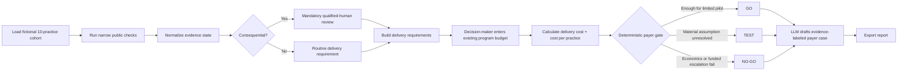
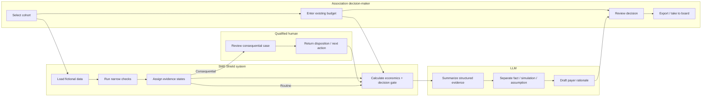
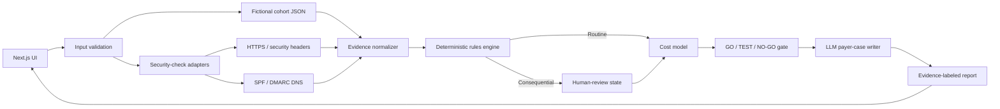

# WEEK 8 PACKET — MONEY
# SME SHIELD · PAYER VIABILITY LAB

> **FREE PROTECTION ≠ FREE DELIVERY**

**Business Bending · Week 8 — When the Tools Outrun the Safeguards**  
**Role:** MONEY  
**Team vacuum:** SME Shield for micro-businesses  
**Individual working slice:** Test whether an intermediary can economically fund the delivery and mandatory human-escalation layer around free / low-cost cybersecurity protections.  
**Packet status:** BEFORE CODE.

---

# 0. EXECUTIVE PRODUCT BLUEPRINT — THE WHOLE BUILD ON ONE PAGE

## The question
**Can a trusted intermediary fund qualified cyber delivery for a cohort of Mexican micro-businesses without inventing ROI?**

## User → Problem → Decision → Success
| USER | PROBLEM | DECISION | SUCCESS |
|---|---|---|---|
| Member-services / program decision-maker at a Mexican dental association | Basic protections may be free, but distribution, explanation, verification and qualified escalation are not | Is there enough evidence and existing budget to justify a limited SME Shield pilot? | User can review a fictional 10-practice cohort, enter a real program budget, see delivery economics + fixed escalation, and receive an evidence-labeled GO / TEST / NO-GO |

## The MONEY thesis
The victim is not automatically the payer. The build therefore starts with an intermediary that already has a relationship, a channel, and a budget around the protected SME. It tests **delivery economics**, not fear.

## The product loop
**Free / low-cost controls → accountable delivery → serious cases to humans → existing budget → evidence-labeled payer decision**

## The non-negotiable
**Serious cases reach a qualified human whatever the price tier.**

## The honesty rule
A green answer is not the goal. **TEST** and **NO-GO** are valid outputs. No breach-avoidance ROI. No “safe” badge. No fake 10:1.

## Dragon Stack
**LLM + security tooling/APIs + structured simulated data + deterministic automation**

## Benchmark
**Global Cyber Alliance Small Business Toolkit** is the best existing benchmark for free SME protection and partner / association distribution.  
**Our difference:** local Mexican payer economics + accountable human escalation + evidence-state discipline.

## What we are NOT building
Antivirus · password manager · credential vault · SOC · autonomous incident response · e.firma storage · real-person breach lookup · cyber-loss calculator.

---

# 1. PROBLEM IN MY WORDS

The Week 8 problem is not a lack of cybersecurity tools. Many foundational protections already exist as free, inexpensive, or commodity capabilities: HTTPS configuration, security headers, SPF / DKIM / DMARC checks, basic exposure checks, safer fiscal-identity practices, and public guidance for what to do after a suspected incident.

The gap appears after the tool exists.

Someone still has to get the protection in front of a small business, explain it in language the owner can act on, distinguish a real finding from an inconclusive check, and ensure that consequential cases reach qualified judgment. Those activities create delivery cost even when the underlying control is free.

The Blueprint also changed the economic question: **being the victim does not make someone the payer.** A micro-business can be vulnerable and still be a weak direct buyer. My MONEY slice therefore moves one layer upstream and asks whether a trusted intermediary - such as a professional association, insurer, accounting firm, or MSSP - can fund delivery using money it already spends around that relationship.

The product question is:

> **Can an intermediary justify paying to deliver a free / low-cost SME cybersecurity shield because doing so supports an economic relationship it already funds - without inventing ROI from hypothetical breaches?**

This prototype is not designed to prove the answer is yes. It is designed to make the answer testable.

---

# 2. WHY THIS SLICE, AND WHY NOT TALENT BRIDGE?

My Brain Bending began with Talent Bridge: use AI to stretch scarce specialist judgment so an MSSP could serve a previously excluded segment. That hypothesis survived conceptually, but the Fusion parked it for this week because we do not have MSSP access and cannot test the access threshold honestly.

The team selected **SME Shield** as the primary vacuum. My individual declaration became a payer map: test who would actually pay to deliver SME Shield and at what price using existing spending.

That is why this build is not a generic SME security app. It is the **MONEY layer of SME Shield**.

### What survived from Talent Bridge
One design rule became a Blueprint condition and remains load-bearing here:

> **Customer price tier cannot determine the threshold for mandatory specialist escalation.**

That means the payer can affect what delivery model is economically possible, but not whether a serious case deserves qualified judgment.

---

# 3. EXACT USER

## Primary user — Mariana Torres
**43 · Member Services Director · fictional Mexican dental association**

Mariana manages member programs, vendor relationships, education events, and a limited annual member-support budget. She understands budgets and operations. She does not know how to interpret DNS records, security headers, or raw incident telemetry.

She is skeptical of fear-based cybersecurity pitches. She needs to explain any proposed program to a board and wants to know:

- What exactly are we funding?
- Which inputs are real versus simulated?
- How much does delivery cost?
- Which cases require a human?
- What are we assuming?
- What do we still need to test before approving anything?

### Her job-to-be-done
> “Tell me whether this proposed SME Shield pilot is economically and operationally credible enough to test with members - without asking me to become a cybersecurity analyst.”

## Protected beneficiary
A small dental practice.

The practice benefits from the shield, but the prototype deliberately does not assume that the dentist is the payer.

## Secondary actor
A qualified security reviewer who receives consequential cases.

## Explicit non-user
A patient. The build contains no patient or clinical data.

---

# 4. JOB STORY

**When** I am considering a new member-support program for small practices,  
**I want** to see what protection would actually be delivered, what it would cost, which cases require qualified human help, and which assumptions remain unproven,  
**so that** I can decide whether to test the program without approving it based on fear, jargon, or invented ROI.

---

# 5. SUCCESS DEFINITION — “BEFORE THE MODULE CLOSES, X WORKS”

Before the module closes, Mariana can:

1. Open a cohort of **10 fictional Mexican dental practices**.
2. See a visible banner: **SIMULATED PILOT DATA · No real PII, credentials, or breach data**.
3. Review a narrow set of free / low-cost protections.
4. See every result labeled as **CONFIRMED / ASSUMPTION / COULD NOT CHECK / ESCALATE**.
5. Enter an **existing annual program budget in MXN**.
6. See total delivery cost, cost per practice, and funded human-escalation reserve.
7. See at least one case that requires a human regardless of budget.
8. Generate an AI-assisted payer case whose underlying decision is deterministic.
9. Receive **GO / TEST / NO-GO** with an explicit definition.
10. Export a one-page evidence-labeled payer report.

### The build succeeds even if the answer is NO-GO.
The objective is a better decision, not a positive answer.

---

# 6. IMAGE-GENERATED MOCKUP


### Why this screen exists
The dashboard forces four things onto the same decision surface:

- **Cohort** — who would receive the program.
- **Protection layer** — what the intermediary is actually funding.
- **Payer case** — whether delivery fits an existing budget.
- **Human escalation** — what cannot be optimized away.

The sample output is **TEST**, intentionally. Budget fit alone does not prove willingness to pay or member adoption.

---

# 7. BENCHMARK LINE — REQUIRED BY THE PACKET

## Best existing solution on Earth
**Global Cyber Alliance — Cybersecurity Toolkit for Small Business.**

It provides free tools and guidance for SMEs and explicitly supports distribution through connected organizations such as partners and business associations. That is the closest benchmark to our “free protection + intermediary channel” mechanism.

## Mine differs / localizes by
**SME Shield Payer Viability Lab does not compete with the free controls. It tests the missing Mexican delivery economics: whether a specific intermediary can fund local delivery plus mandatory human escalation for a defined cohort using existing budget, without manufacturing breach-avoidance ROI.**

## Mexican adjacent benchmark
**AMITI — PyMEs Ciberseguras (2026)** provides a free route with self-assessment, risk-measurement tools, and practical training. It supports the idea that cyber capacity can be distributed through institutional channels in Mexico. It does **not** prove willingness to pay for this product.

---

# 8. FEATURE FLOW — VISUAL + MERMAID CODE




### What this diagram proves
The LLM appears **after** evidence normalization, escalation rules, and economic calculations. It writes the explanation. It does not decide the safety state or manufacture the economics.

---

# 9. MULTI-ACTOR SWIMLANE — VISUAL + MERMAID CODE




### Load-bearing separation of duties
- The **association** owns the funding decision.
- The **system** owns deterministic evidence and cost logic.
- The **qualified human** owns consequential judgment.
- The **LLM** owns structured explanation, not authority.

---

# 10. SYSTEM ARCHITECTURE — VISUAL + MERMAID CODE




### Architectural rule
If the LLM is unavailable, the product must still calculate and display the deterministic payer state. The narrative can fail gracefully; the decision logic cannot depend on model improvisation.

---

# 11. DRAGON STACK

| REQUIRED LAYER | IMPLEMENTATION | JOB | HARD LIMIT |
|---|---|---|---|
| 🐉 LLM | Server-side LLM call | Turn structured evidence into a payer narrative, assumptions list, and next test | No credentials / PII; cannot change decision state; AI-assisted output labeled |
| 🛡️ Security tooling / APIs | Narrow HTTPS, security-header and DNS SPF/DMARC checks; simulated structured breach adapter allowed | Demonstrate concrete controls being delivered | Timeouts = COULD NOT CHECK; no intrusive scanning |
| 📊 One more: structured data | Typed fictional cohort + delivery-cost schema | Make economics reproducible and testable | Simulated data visibly labeled |
| ⚙️ Automation | Deterministic evidence / escalation / GO-TEST-NO-GO rules | Keep consequential logic out of the LLM | Budget never changes escalation threshold |
| 🌐 Interface | Next.js / TypeScript / Vercel | Decision dashboard + report export | Input validation; no secrets client-side |

---

# 12. WHAT EXACTLY IS THE INTERMEDIARY PAYING FOR?

## Not this
“Cybersecurity information.”

## This
An accountable delivery layer around free / low-cost protections:

1. Owner-verified public-facing checks.
2. Plain-language interpretation.
3. Evidence-state normalization.
4. Local, sourced next-action guidance.
5. Human review for consequential cases.
6. Program administration and communication.
7. Evidence-labeled reporting.

### Key MONEY distinction
**Free tool cost =/= zero cost-to-serve.**

---

# 13. PAYER MAP

| POSSIBLE PAYER | WHY THEY COULD CARE | EXISTING SPEND TO TEST | WHAT WE MUST NOT ASSUME |
|---|---|---|---|
| Dental association / colegio | Member support, education, retention, professional standards | Member education / events / support budget | That cyber automatically increases retention |
| Accounting firm / despacho | Trusted recurring SME relationship; fiscal identity sits near workflow | Client service / support / compliance time | That contador wants security responsibility |
| Insurer | Risk services may support policy relationship | Risk-prevention / service budget | That reduced incidents translate directly to claims savings |
| MSSP | Can distribute qualified defense | Existing service-delivery labor | That lower cost reaches excluded customers |
| SME directly | Direct beneficiary | Existing IT / security spend | That vulnerability equals willingness to pay |

### MVP payer
The first screen is designed around a **dental association** because it matches the Blueprint pilot context and gives the MONEY decision a concrete organizational user.

---

# 14. ECONOMIC MODEL

The MVP uses transparent cost inputs, not a hidden “AI ROI score.”

## Inputs
- Cohort size.
- Existing annual member-support budget.
- One-time onboarding / setup cost.
- Routine delivery cost per practice.
- Human-escalation reserve.
- Optional communication / workshop cost.

## Calculations
**Total delivery cost**  
= setup + (routine delivery cost × cohort size) + escalation reserve + explicit optional costs

**Cost per practice**  
= total delivery cost / cohort size

**Budget headroom**  
= existing entered budget - total delivery cost

## What is deliberately absent
- Probability of breach.
- Average breach loss.
- “Expected loss avoided.”
- Reputation value.
- Hypothetical fines avoided.
- Unapproved future hiring avoided.
- 10:1 ROI.

Those may be interesting later. They are not proven inputs today.

---

# 15. DETERMINISTIC DECISION GATE

## NO-GO
Return NO-GO if any of these is true:

- mandatory human escalation is not funded;
- delivery cost exceeds available entered budget and no explicit alternative funding source exists;
- the design would require prohibited credential / sensitive-data concentration;
- a consequential case has no accountable reviewer.

## TEST
Return TEST when:

- economics fit, but willingness to fund is unvalidated;
- member participation is unknown;
- a material cost input is simulated;
- a check is inconclusive but not itself consequential;
- the next uncertainty can be resolved with a bounded pilot.

## GO
For this prototype, GO means only:

> **Enough evidence to justify a limited pilot.**

It does not mean business model proven, market demand proven, or “secure.”

GO requires:
- delivery cost inside explicit budget;
- funded human escalation;
- no unresolved critical safety condition;
- all assumptions visible;
- an explicit next validation step.

---

# 16. EVIDENCE STATES

| STATE | MEANING | UI RULE |
|---|---|---|
| CONFIRMED | Narrow check produced supported evidence | Show evidence + timestamp |
| ASSUMPTION | Input is simulated or supplied but not independently verified | Yellow state + what must be validated |
| COULD NOT CHECK | Timeout, unavailable endpoint, unsupported target, failed lookup | Neutral state; never green |
| ESCALATE | Consequence threshold requires qualified human judgment | Human action required; cannot close as routine |

### Why no 0–100 risk score?
A score would imply precision we do not possess. The evidence-state model tells the user what the system actually knows.

---

# 17. HUMAN ESCALATION BOUNDARY

A case must become **ESCALATE** when the simulated scenario indicates:

- suspected fiscal-identity / e.firma misuse;
- material identity or account misuse;
- an action requiring private credentials;
- remediation that could materially interrupt operations;
- uncertainty about the correct Mexican institutional route in a consequential case;
- any seeded condition explicitly marked consequential.

## Price independence
The list is the same for every payer tier.

## Override rule
Any override must require:
1. named fictional reviewer;
2. reason;
3. timestamp;
4. audit-log entry.

An override may change workflow disposition. It may never silently relabel a serious case “safe.”

---

# 18. BLUEPRINT CONDITIONS → PRODUCT REQUIREMENTS

| BLUEPRINT CONDITION | BUILD REQUIREMENT | VISIBLE PROOF |
|---|---|---|
| C1 No concentration | No credentials, CURP, biometrics, account numbers, patient data | No upload field; simulated banner |
| C2 Honest states | Confirmed / Assumption / Could not check / Escalate | Evidence chips + failure-state tests |
| C3 Human at consequence boundary | Fixed escalation regardless of budget | Same escalation count when budget changes |
| C4 Trusted existing event/channel | Association-led pilot, not new consumer habit | Association user / cohort flow |
| C5 Local, sourced, dated | Mexican next-action sources with date / limits | Source field in action cards |
| C6 Beat free incumbent | Explain delivery value beyond free controls | Benchmark comparison + payer case |

---

# 19. SECURITY FLOOR — BEFORE CODE

## 1. No secrets in code or repo
- `.env*` ignored.
- API keys only in Vercel environment variables.
- No secret reaches client bundle.
- Run secret check before push.

## 2. Auth if personal data exists
MVP stores no personal data and uses only fictional seed data. Therefore auth is not required for the first slice. If persistence of real organizational / personal data is added, implementation stops until auth exists.

## 3. RLS if Supabase appears
No Supabase database is planned. If user data are introduced, RLS is mandatory before use.

## 4. Validate every form
- Budget: numeric, non-negative, bounded.
- Cohort: integer within seed limits.
- Domain: validated syntax / allowlisted demo targets.
- Notes: length cap.
- Structured wrapping before LLM.

## 5. No real personal data
No real patient, dentist, employee, CURP, e.firma, account, or breach data.

---

# 20. MINI THREAT MODEL

| THREAT | FAILURE | CONTROL |
|---|---|---|
| API secret in GitHub | Bots harvest key | Env vars + secret scan |
| Credential collection | Product becomes richest target | No credential fields or schema |
| Prompt injection | Narrative becomes untrusted | Structured input + model has no decision authority |
| Timeout shown as safe | False confidence | Explicit COULD NOT CHECK enum |
| LLM invents ROI | Violates MONEY discipline | Calculations happen before LLM + forbidden claims |
| Cheap tier suppresses human review | Risk transferred to weaker payer | Escalation independent of price |
| Real person in demo | Privacy / grading violation | Fictional seeds + visible labels |
| Over-broad scanner | Unauthorized / unsafe behavior | Narrow public checks only |

---

# 21. DATA MODEL

```ts
type Practice = {
  id: string;
  fictionalName: string;
  city: string;
  website?: string;
  businessEmailDomain?: string;
  dataLabel: "SIMULATED";
};

type FindingState =
  | "CONFIRMED"
  | "ASSUMPTION"
  | "COULD_NOT_CHECK"
  | "ESCALATE";

type Finding = {
  practiceId: string;
  control: "HTTPS" | "HEADERS" | "SPF" | "DMARC" | "EFIRMA_HYGIENE" | "BREACH_GUIDANCE";
  state: FindingState;
  evidence: string;
  checkedAt: string;
  consequential: boolean;
};

type PayerInputs = {
  cohortSize: number;
  existingAnnualBudgetMXN: number;
  onboardingCostMXN: number;
  routineDeliveryCostPerPracticeMXN: number;
  humanEscalationReserveMXN: number;
};

type PayerDecision = {
  state: "GO" | "TEST" | "NO_GO";
  totalDeliveryCostMXN: number;
  costPerPracticeMXN: number;
  withinExistingBudget: boolean;
  fundedHumanEscalation: boolean;
  unresolvedAssumptions: string[];
};
```

---

# 22. PAYER-CASE OUTPUT CONTRACT

The generated payer case must contain exactly these conceptual sections:

### Decision
GO / TEST / NO-GO and what that state means.

### What we know
Only deterministic checks and explicit user inputs.

### What is simulated
Seed cohort, seeded findings, assumed delivery times, or simulated API results.

### Economics
Budget · total delivery cost · cost/practice · escalation reserve · headroom/gap.

### Why the intermediary might care
Describe the existing relationship. Do not invent a financial benefit.

### What we cannot claim
Breach prevention · avoided loss · 10:1 · willingness to pay · broad market demand.

### Next test
One concrete action needed to move the current decision.

---

# 23. SCOPE CUT — NOT BUILDING

**Forbidden / solved:** antivirus, password manager.

**Out of MVP:** endpoint agent, SOC, autonomous response, credential vault, e.firma upload / renewal, CURP / biometric collection, real-person breach lookup, patient data, clinical records, CRM, payments, insurer underwriting, MSSP marketplace, cyber-loss probability, 10:1 ROI calculator, enforcement, general-purpose cyber chatbot.

### Scope-cut rule
If time gets tight, cut visual polish or secondary controls before cutting:
1. honest evidence states;
2. escalation independence;
3. no-sensitive-data design;
4. deterministic payer gate;
5. visible simulation labels.

---

# 24. TEST PLAN — MECHANICAL PASS

## Functional
- [ ] 10 fictional practices load.
- [ ] Simulation banner is above the fold.
- [ ] Valid budget accepted.
- [ ] Negative / malformed budget rejected.
- [ ] Cost/practice math correct.
- [ ] All evidence states render.
- [ ] COULD NOT CHECK never becomes green / safe.
- [ ] Consequential case always escalates.
- [ ] Budget changes do not alter escalation threshold.
- [ ] Missing escalation funding forces NO-GO.
- [ ] Unvalidated payer willingness can force TEST even when budget fits.
- [ ] Deterministic state exists before LLM call.
- [ ] LLM output lists assumptions and cannot-prove claims.
- [ ] Export works and contains simulation label.

## Security
- [ ] No secrets in repo.
- [ ] No credential input exists.
- [ ] No real PII in seeds.
- [ ] API route validates payload.
- [ ] Text fields have length caps.
- [ ] LLM cannot modify deterministic state.

## Failure behavior
- [ ] Security timeout → COULD NOT CHECK.
- [ ] LLM unavailable → deterministic result still displays.
- [ ] Unsupported target → no scan; limitation shown.
- [ ] Export error → recoverable error, not false success.

## Required course cycle
**Find at least one real bug → document reproduction → fix → commit → redeploy.**

---

# 25. PERSONA TEST

## Persona
**Mariana Torres, 43, Member Services Director at a fictional dental association in Mexico City.**

She works with budgets, vendors, Excel, events, and member communications. She is not a cybersecurity specialist. She distrusts fear-based vendor claims and will not take a proposal to the board if she cannot explain where the numbers came from.

## Task
> “Your association has an existing annual member-support budget. Review this proposed SME Shield pilot for 10 fictional dental practices. Decide whether you have enough evidence to recommend a limited pilot to your board. Narrate where you hesitate, what you do not understand, what feels unsupported, and what would stop you.”

## Screens in order
1. Overview / simulation banner.
2. Cohort.
3. Protection layer.
4. Payer inputs.
5. Human escalation.
6. Generated payer case.
7. Exported report.

## Questions
1. What did you think you were being asked to decide?
2. Which number did you trust least?
3. Did anything imply a cyber incident would definitely be prevented?
4. Did you understand why some cases require a human?
5. Did TEST feel useful or like failure?
6. What information would you need before taking this to the board?
7. What single change would make this usable in a normal workday?

## Required fix
Fix the worst confusion, redeploy, and document before / after.

---

# 26. ACCEPTANCE CRITERIA

- [ ] Live URL works.
- [ ] Simulated-data label above fold.
- [ ] 10 fictional practices.
- [ ] No real PII / credentials.
- [ ] At least 3 evidence states demonstrated.
- [ ] At least 1 mandatory human escalation.
- [ ] Budget changes economics.
- [ ] Budget does not change escalation threshold.
- [ ] GO / TEST / NO-GO deterministic.
- [ ] TEST reachable and understandable.
- [ ] No hypothetical breach-avoidance ROI.
- [ ] AI-assisted narrative labeled.
- [ ] LLM cannot override decision.
- [ ] Export works.
- [ ] Mechanical pass found + fixed a real bug.
- [ ] Redeployed after bug fix.
- [ ] Persona test completed.
- [ ] Worst persona confusion fixed.
- [ ] Minimum 5 commits.
- [ ] Minimum 2 deploys.
- [ ] DECISIONS.md updated every session close.

---

# 27. COMMIT + DEPLOY PLAN

1. `docs: add Week 8 packet and diagrams`
2. `feat: scaffold simulated payer viability dashboard`
3. `feat: add security evidence states and escalation rules`
4. `feat: add payer economics and deterministic decision gate`
5. `feat: add AI-assisted payer case and report export`
6. `test: document mechanical pass and fix deployed bug`
7. `fix: apply persona-test usability improvement`
8. `docs: close decisions and demo notes`

### Deploy 1
After deterministic dashboard + decision gate.

### Deploy 2
After mechanical bug fix.

### Final deploy
After persona fix.

---

# 28. SESSION CLOSE

Every session ends with:

1. Update `DECISIONS.md`.
2. Record what changed.
3. Record what was rejected.
4. Record unresolved risk.
5. Write tomorrow’s first move.
6. Run tests.
7. Commit.
8. Push.

### Initial decisions
- Talent Bridge parked, not dead.
- SME Shield is primary team vacuum.
- MONEY slice tests payer / delivery viability.
- No real PII or credentials.
- No hypothetical breach-avoidance ROI.
- LLM explains; deterministic code decides.
- Serious-case escalation independent of payer tier.
- Free incumbents are benchmarks, not features to repackage.

---

# 29. THREE-YEAR LIGHT CHARTER

If this slice works, SME Shield becomes an intermediary-delivered security layer embedded into events small businesses already experience: association membership, accounting close, insurance renewal, payroll changes, or other trusted operational moments. The full product does not become another cybersecurity dashboard; it becomes infrastructure that lets a trusted intermediary distribute free / low-cost protections, route consequential cases to accountable humans, and prove what was checked without becoming a repository of sensitive credentials. In three years, the load-bearing walls remain the same: **no concentration of secrets, honest evidence states, local sourced actions, payer accountability, and human judgment at the consequence boundary.**

---

# 30. WHAT WOULD KILL THIS IDEA?

A strong packet must make the idea falsifiable.

Confidence should fall if:

- intermediaries have no existing budget that could fund delivery;
- cost-to-serve remains above any credible payer threshold;
- human escalation destroys the economics;
- free incumbents already provide the same accountable delivery layer;
- decision-makers do not understand or value the payer case;
- the only attractive ROI comes from hypothetical breach avoidance;
- the product needs sensitive credential concentration to be useful;
- qualified human review must be weakened to reach a lower price.

**A clean NO-GO is a valid Week 8 result.**

---

# 31. IMPLEMENTATION-PROMPT HANDOFF

The next LLM step must convert this packet into a coding-agent prompt with:

- small testable features;
- acceptance criteria per feature;
- tests written alongside features;
- explicit commit boundaries;
- first deploy before AI polish;
- deterministic rules before LLM narrative;
- fictional data only;
- no credentials / PII;
- no invented ROI;
- visible simulation labels;
- Session Close after every build session.

**No coding agent may silently broaden scope beyond this packet.**

---

# 32. SOURCES / EVIDENCE BASIS

1. **Week 8 Team 6 Blueprint.** Primary vacuum: SME Shield. MONEY declaration: test who would pay to deliver SME Shield and at what price using real existing spending. Conditions include no concentration, honest states, tier-independent serious-case escalation, local sourced routes, and “beat the free incumbent or don’t claim value.”
2. **Global Cyber Alliance — Cybersecurity Toolkit for Small Business.** Benchmark for free SME cyber tools and partner / association distribution.  
   https://globalcyberalliance.org/work/gca-cybersecurity-toolkit/gca-cybersecurity-toolkit-for-small-business/
3. **AMITI — PyMEs Ciberseguras, 15 July 2026.** Mexican adjacent benchmark for free SME assessment, risk-measurement tools, and training.  
   https://amiti.org.mx/en/15445/amiti-y-aliados-lanzan-la-iniciativa-pymes-ciberseguras-para-blindar-el-motor-economico-de-mexico-ante-la-ola-de-ataques-digitales/

---

# 33. PROFESSOR CHECK — DOES THE PACKET HIT EVERY REQUIRED ITEM?

| COURSE REQUIREMENT | WHERE IT IS |
|---|---|
| Problem in your words | §1 |
| Exact user | §3 |
| Success definition | §5 |
| Image-generated mockup | §6 |
| Flow as Mermaid | §8 |
| Multi-actor swimlane | §9 |
| Benchmark line | §7 |
| 3-year light charter | §29 |
| Scope cut | §23 |
| Architecture + stack table | §10–11 |
| Test plan | §24 |
| Security floor | §19–20 |
| Blueprint conditions honored | §18 |
| Dragon Stack | §11 |
| Persona-test preparation | §25 |
| Commit / deploy discipline | §27–28 |

## PACKET STATUS
**READY FOR IMPLEMENTATION PROMPT. NOT READY FOR CODE UNTIL SAVED AS `docs/PACKET.md`.**
